

  
  <h1>DevCLT Timer 🚀</h1>

O **DevCLT Timer** é a ferramenta definitiva para desenvolvedores CLT que precisam controlar sua jornada de trabalho com precisão, sem abrir mão da produtividade.

Com uma interface moderna e discreta, ele gerencia seus horários de trabalho, pausas e horas extras, garantindo que você mantenha o foco no código via **Atalhos Globais** e notificações inteligentes.

---

## ✨ Funcionalidades Principais

### ⏱️ Controle de Jornada
- **Timer Inteligente**: Contagem regressiva para jornada e pausas, e progressiva para horas extras.
- **Estados de Trabalho**: Alterne facilmente entre *Trabalhando*, *Em Pausa* e *Hora Extra*.
- **Notificações**: Receba alertas (Toasts) quando o tempo de pausa acabar ou quando atingir marcos de hora extra.
  
  

    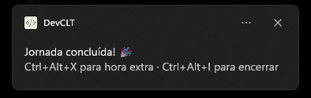
  

### ⌨️ Produtividade Máxima
- **Atalhos Globais (Hotkeys)**: Controle o timer de qualquer lugar do Windows, mesmo com o app minimizado.
  - Padrão:
    - **Ctrl+Alt+I**: Iniciar/Retomar Trabalho
    - **Ctrl+Alt+P**: Iniciar Pausa
    - **Ctrl+Alt+X**: Hora Extra
- **System Tray**: O app pode ser minimizado para a bandeja do sistema, rodando em segundo plano sem ocupar espaço na barra de tarefas.

### 📊 Histórico e Relatórios
- **Visão Completa**: Acompanhe seu desempenho por **Semana**, **Mês** e **Ano**.
- **Painel Anual**: Visualize o acumulado de horas trabalhadas e extras ao longo do ano.
- **Exportação CSV**: Exporte seus dados de qualquer visualização para planilha (Excel/Google Sheets) para relatórios de horas.

### 🎨 Design e UX
- **Modo Escuro**: Tema *Floresta Noturna* para conforto visual.
- **Interface Moderna**: Desenvolvido em WPF com estilos customizados e bordas arredondadas (Windows 11 style).
- **Sem Perda de Dados**: Persistência local segura com SQLite. Se fechar o app, ele recupera o estado exato ao reabrir.

## 📸 Galeria

🌑 Modo Escuro

| | |
|:---:|:---:|
| 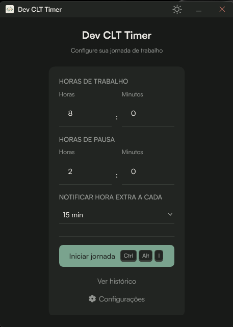 | 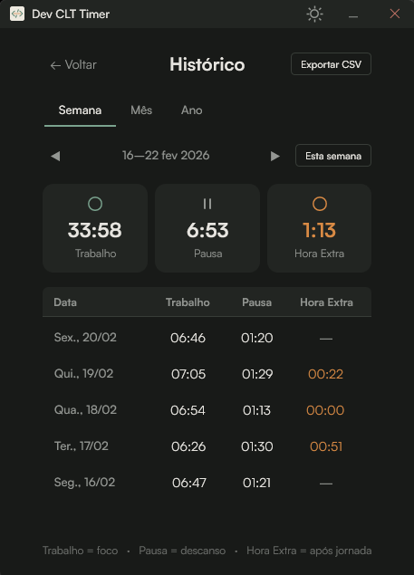 |
| 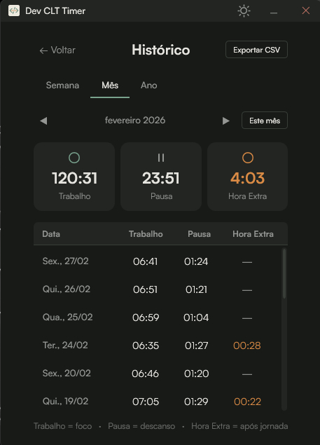 | 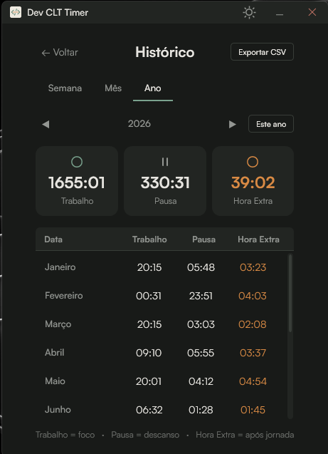 |
| 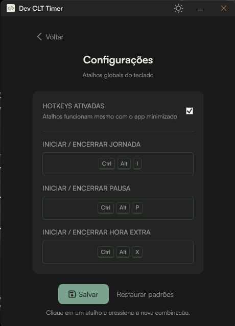 |  |
| 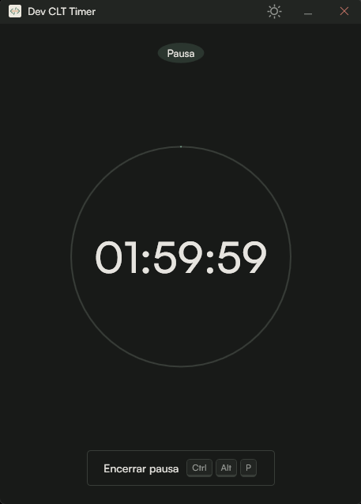 | 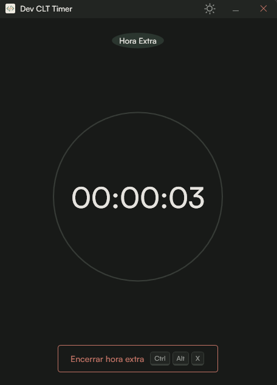 |

☀️ Modo Claro

| | |
|:---:|:---:|
| 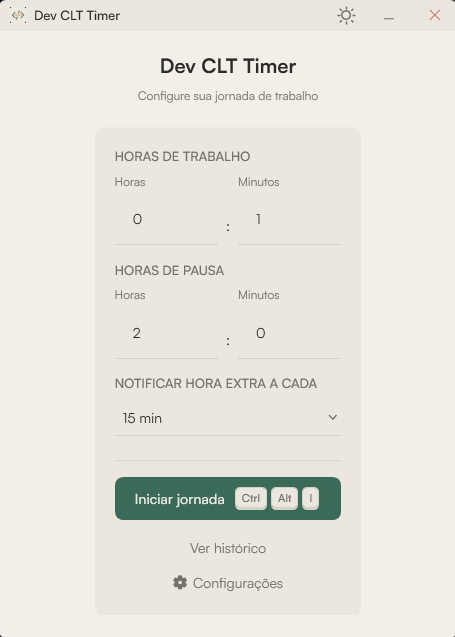 | 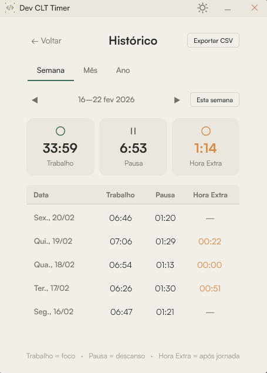 |
| 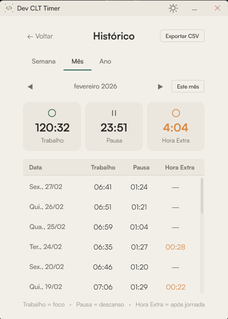 | 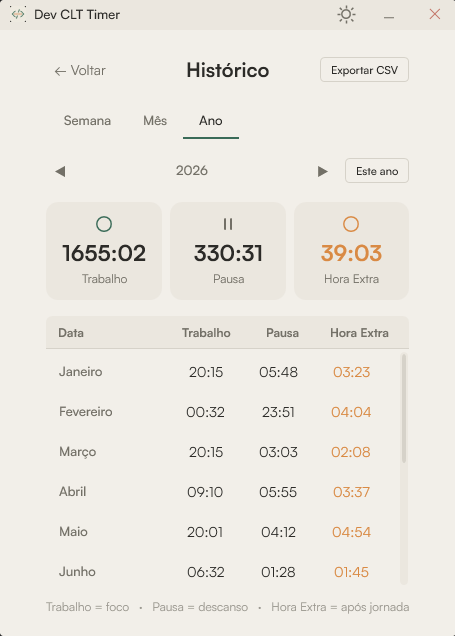 |
|  | 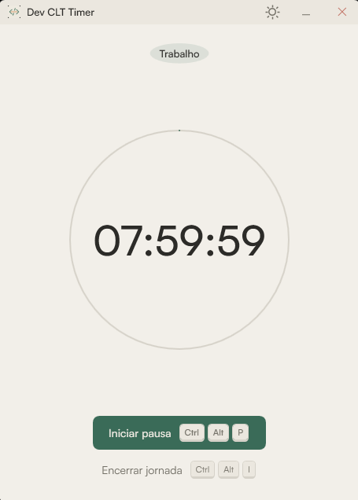 |
| 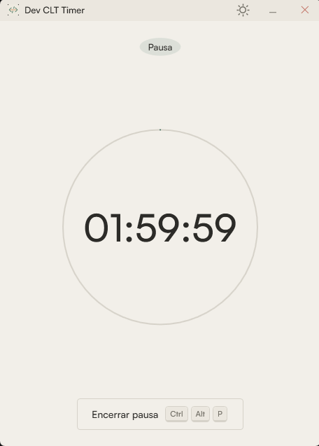 | 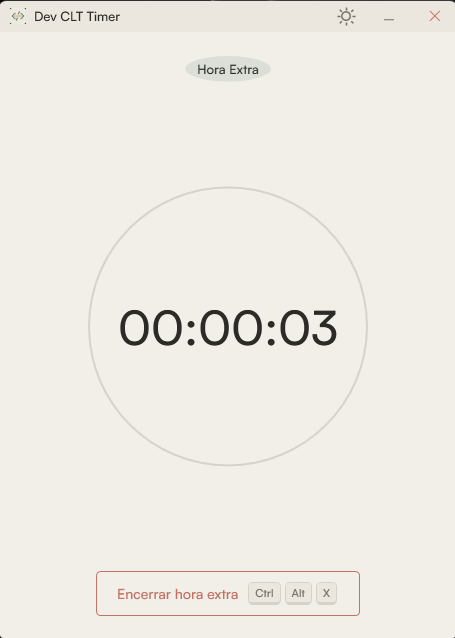 |

---

## 🛠️ Configuração

Acesse a tela de **Configurações** (ícone de engrenagem) para:
- **Personalizar Atalhos**: Grave suas próprias combinações de teclas para as ações globais.
- **Ativar/Desativar Hotkeys**: Controle total sobre quando os atalhos devem funcionar.

---

## 🚀 Como Usar

1. **Abra o App**: O timer inicia pronto para começar.
2. **Inicie a Jornada**: Clique em Play ou use `Ctrl+Alt+I`.
3. **Pausas**: Precisa de um café? Use `Ctrl+Alt+P`. O tempo de pausa é descontado corretamente.
4. **Fim do Dia**: Ao atingir a meta, você pode encerrar ou entrar em **Hora Extra** (`Ctrl+Alt+X`).
5. **Acompanhe**: Veja o histórico na aba de calendário para garantir que suas horas estão em dia.

---

## 📦 Instalação

Baixe a versão mais recente na aba [Releases do GitHub](https://github.com/naicolas-dev/DevCLTTimer/releases).
O executável é *portable* (não requer instalação) e auto-contido.

---

## 💻 Tech Stack

- **.NET 8**: Performance e modernidade.
- **WPF**: Interface nativa Windows rica e responsiva.
- **SQLite**: Banco de dados local robusto e leve.
- **MVVM**: Arquitetura limpa e testável.

---

Desenvolvido por naicolas para a comunidade Dev. <3

<!-- Pretty Boy -->

  

